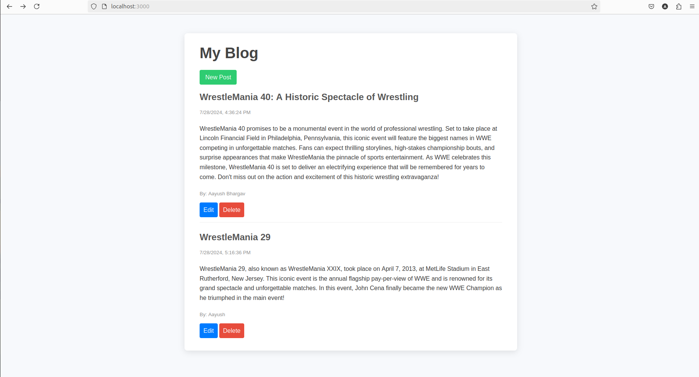

# Blog Website

This is a very simple blog website that allows users to create, read, update, and delete blog posts. The project is built using Node.js, Express, PostgreSQL, and EJS for templating.

## Installation

 Clone the repository
   ```
   git clone https://github.com/Aayush-Bhargav/Blog-Website.git
   cd Blog-Website
   ```
Install dependencies
```
npm install
```
## Set up PostgreSQL database

1. Create a PostgreSQL database named `info`.

2. Create a `posts` table using the following SQL:
```
    CREATE TABLE posts (
      id SERIAL PRIMARY KEY,
      title VARCHAR(100) NOT NULL,
      content TEXT NOT NULL,
      author VARCHAR(30) NOT NULL,
      date TIMESTAMPTZ NOT NULL
    );
```

## Set up  Environment Variables
Run
```
cp sampleEnv.txt .env
```
and replace the required details.

## Launch
Start the API server
```
nodemon index.js
```
Start the Backend server
```
nodemon server.js
```
Open your browser and navigate to http://localhost:3000.

## Screenshots
### Home Page


## Usage

- **Home Page**: Displays a list of all blog posts.
- **New Post**: Click the "New Post" button to create a new blog post.
- **Edit Post**: Click the "Edit" link next to a post to edit it.
- **Delete Post**: Click the "Delete" link next to a post to delete it.

## API Endpoints

- **GET /posts**: Retrieve all posts.
- **GET /posts/:id**: Retrieve a specific post by ID.
- **POST /posts**: Create a new post.
- **PATCH /posts/:id**: Update a specific post by ID.
- **DELETE /posts/:id**: Delete a specific post by ID.
